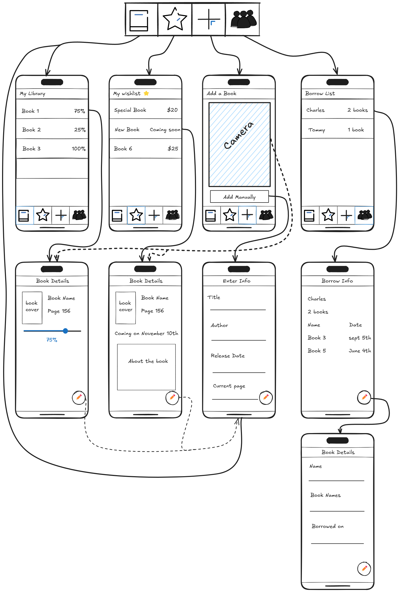
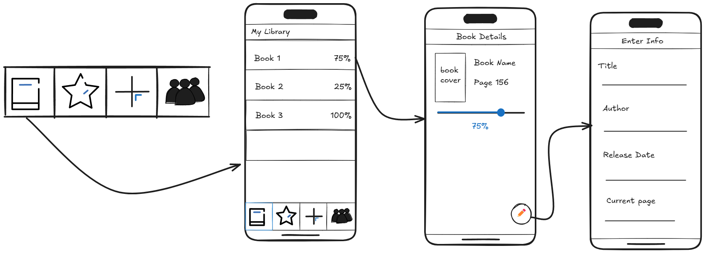
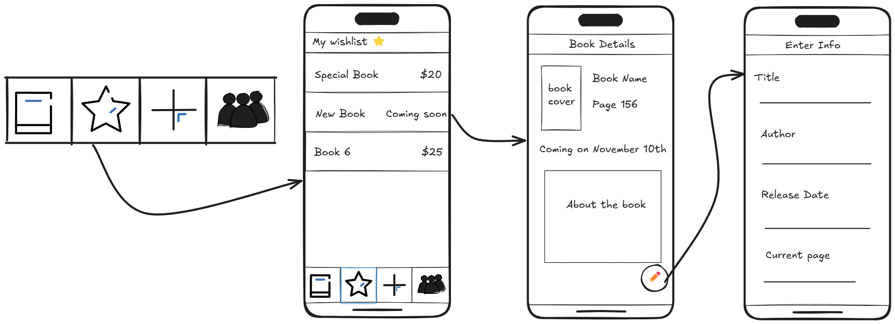
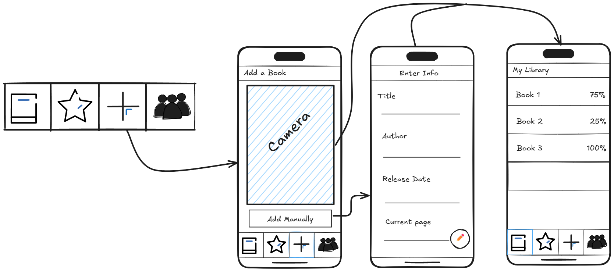
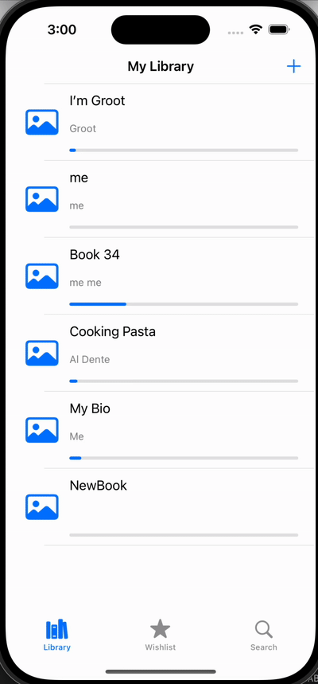

Original App Design Project
===

# Book Vault

## Table of Contents

1. [Overview](#Overview)
2. [Current Issues](#Current-Issues)
3. [Product Spec](#Product-Spec)
4. [Wireframes](#Wireframes)
5. [Schema](#Schema)

## Overview

### Description

An app to easily catalog personal book collections using ISBN scanning, manage reading status, and track loans.

## Current Issues

- [ ] Wishlist table view is not implemented yet
- [ ] Wishlist buttons need to be added
- [ ] Tapping a book should show a detailed view, not edit
- [ ] Borrowed books list is not implemented yet
- [ ] No search or filter functionality for books
- [ ] No support for custom shelves or categories
- [ ] No data import/export (e.g., CSV backup)
- [ ] No error handling for invalid or incomplete book data
- [ ] No user feedback for successful or failed actions (e.g., save, delete)
- [ ] No onboarding or help for new users

### App Evaluation

   * **Description**: An app for cataloging and managing personal book collections. Users can quickly add books by scanning ISBN barcodes, or by typing the title of the book, searching online databases, or entering manually. Features include organizing books onto custom shelves/categories, tracking reading status, adding personal notes/ratings, and managing loans.
   * **Category:** Reference / Productivity / Lifestyle / Books & Reading
   * **Mobile:** Key for the ISBN scanning feature using the phone's camera. Allows users to catalog books anywhere (bookstore, friend's house), check if they already own a book while shopping, and manage their library on the go.
   * **Story:** Brings order to personal book collections, helping users rediscover forgotten books, avoid buying duplicates, track their reading journey, and easily remember who borrowed their books. Transforms a physical collection into a searchable, manageable digital database.
   * **Market:** Anyone with a significant personal book collection, avid readers, collectors, students.
    * **Habit:** Users engage when acquiring new books, finishing books (updating status), lending/borrowing books, or browse their collection to decide what to read next.
* **Scope:**
        * V1: ISBN barcode scanning, manual entry, basic book data fetching (title, author, cover), simple list view.
        * V2: Add custom shelves/categories, reading status tracking (To Read, Reading, Read), basic sorting/filtering.
        * V3: Implement loan tracking (who borrowed, when), personal notes and rating fields, wishlist feature.
        * V4: Introduce advanced search (genre, tags, keywords in notes), data import/export (CSV).

## Product Spec

### 1. User Stories (Required and Optional)

**Required Must-have Stories**

* User can view a list of books in their library
* User can add a new book (title, author, page count, current page)
* User can edit an existing book’s details
* User can track reading progress (current page vs. total pages)
* User can delete a book from their library
* User sees an empty state when there are no books

**Optional Nice-to-have Stories**

* User can add personal notes to a book
* User can search or filter books
* User can organize books into custom shelves or categories
* User can track books they wish to read (wishlist)
* User can track books they have loaned out

### 2. Screen Archetypes

- [x] Library (Book List)
  * User can view all books
  * User can tap to edit a book
  * User can delete a book

- [x] Add/Edit Book
  * User can enter or edit book details (title, author, pages, current page)
  * User can save or cancel

- [ ] Wishlist
  * User can view and manage books they wish to read
- [ ] Search
  * User can search a database of book by using the title of the book 
    

### 3. Navigation

**Tab Navigation** (Tab to Screen)

* Library
* Wishlist

**Flow Navigation** (Screen to Screen)

- Library
  * => Add/Edit Book
- Wishlist
  * => Add/Edit Book

## Wireframes

## Current Build

## Schema 

### Models

#### Book

| Property      | Type     | Description                          |
| ------------- | -------- | ------------------------------------ |
| id            | String   | Unique identifier for the book       |
| title         | String   | Title of the book                    |
| author        | String?  | Author of the book                   |
| currentPage   | Int?     | Current page the user is on          |
| numberPages   | Int?     | Total number of pages in the book    |
| note          | String?  | Optional personal note about the book|

### Networking

All data is stored locally using `UserDefaults`.  
No network requests are implemented yet.
