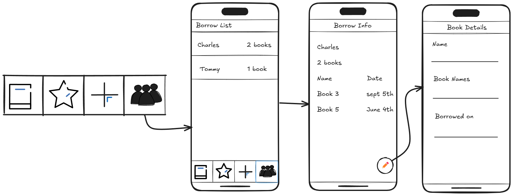

Original App Design Project
===

# Book Vault

## Table of Contents

1. [Overview](#Overview)
2. [Product Spec](#Product-Spec)
3. [Wireframes](#Wireframes)
4. [Schema](#Schema)

## Overview

### Description

An app to easily catalog personal book collections using ISBN scanning, manage reading status, and track loans.

### App Evaluation

   * **Description**: An app for cataloging and managing personal book collections. Users can quickly add books by scanning ISBN barcodes, or by typing the title of the book, searching online databases, or entering manually. Features include organizing books onto custom shelves/categories, tracking reading status, adding personal notes/ratings, and managing loans.
   * **Category:** Reference / Productivity / Lifestyle / Books & Reading
   * **Mobile:** Key for the ISBN scanning feature using the phone's camera. Allows users to catalog books anywhere (bookstore, friend's house), check if they already own a book while shopping, and manage their library on the go.
   * **Story:** Brings order to personal book collections, helping users rediscover forgotten books, avoid buying duplicates, track their reading journey, and easily remember who borrowed their books. Transforms a physical collection into a searchable, manageable digital database.
   * **Market:** Anyone with a significant personal book collection, avid readers, collectors, students.
    * **Habit:** Users engage when acquiring new books, finishing books (updating status), lending/borrowing books, or browse their collection to decide what to read next.
* **Scope:**
        * V1: ISBN barcode scanning, manual entry, basic book data fetching (title, author, cover), simple list view.
        * V2: Add custom shelves/categories, reading status tracking (To Read, Reading, Read), basic sorting/filtering.
        * V3: Implement loan tracking (who borrowed, when), personal notes and rating fields, wishlist feature.
        * V4: Introduce advanced search (genre, tags, keywords in notes), data import/export (CSV).

## Product Spec

### 1. User Stories (Required and Optional)

**Required Must-have Stories**

* [fill in your required user stories here]
* ...

**Optional Nice-to-have Stories**

* [fill in your required user stories here]
* ...

### 2. Screen Archetypes

- [ ] [list first screen here]
* [list associated required story here]
* ...
list second screen here]
* [list associated required story here]
* ...

### 3. Navigation

**Tab Navigation** (Tab to Screen)

* [fill out your first tab]
* [fill out your second tab]
* [fill out your third tab]

**Flow Navigation** (Screen to Screen)

- [ ] [list first screen here]
* [list screen navigation here]
* ...
- [ ] [list second screen here]
* [list screen navigation here]
* ...

## Wireframes

### [BONUS] Digital Wireframes & Mockups

### [BONUS] Interactive Prototype

## Schema 

[This section will be completed in Unit 9]

### Models

[Add table of models]

### Networking

- [Add list of network requests by screen ]
- [Create basic snippets for each Parse network request]
- [OPTIONAL: List endpoints if using existing API such as Yelp]
